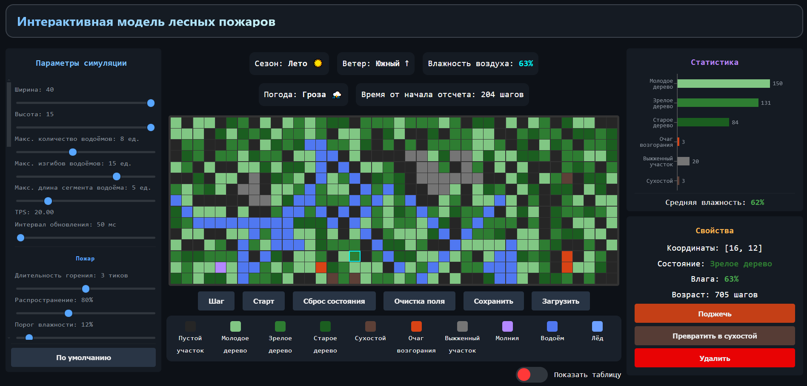
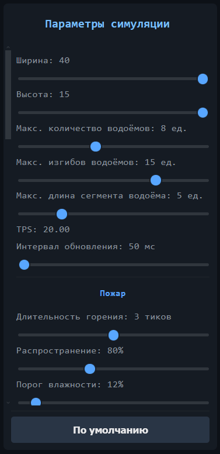
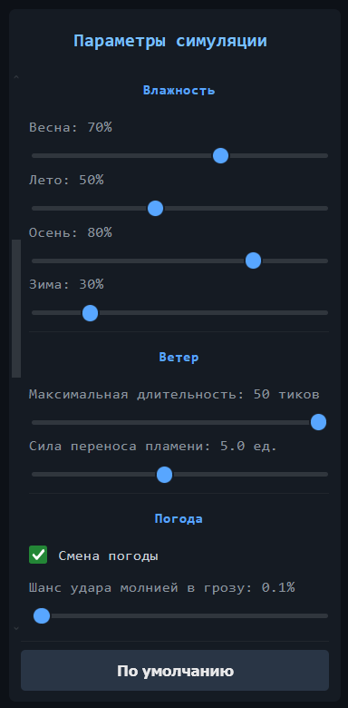
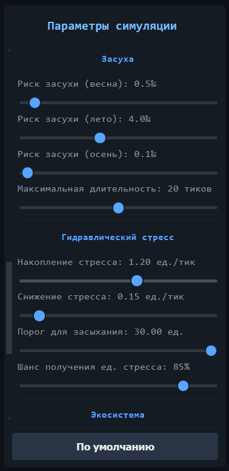
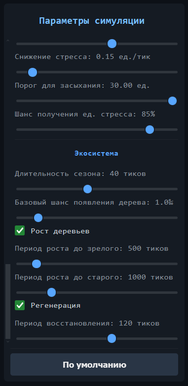

# 🌲 Интерактивная модель лесных пожаров

[](https://react.dev/)
[](https://developer.mozilla.org/en-US/docs/Web/JavaScript)
[](https://vite.dev/)

> Стохастическая модель динамики лесных экосистем с учётом роста деревьев, климатических факторов, распространения пожаров и восстановления леса.

---

## Оглавление

- [Описание](#-описание)
- [Технологический стек](#-технологический-стек)
- [Структура проекта](#-структура-проекта)
- [Математическая модель](#-математическая-модель)
- [Скриншоты](#-скриншоты)

## Описание

**Интерактивная модель лесных пожаров** — это веб-приложение, моделирующее динамику лесного участка с учётом множества взаимосвязанных факторов:

- **Рост деревьев** — переход между возрастными стадиями (молодое => зрелое => старое)
- **Климат** — смена сезонов, глобальная влажность, экстремальные засухи
- **Ветер** — направление и сила, влияющие на распространение огня
-  **Погода** — три состояния (ясно, дождь, гроза) с ударами молний и тушением осадками
- **Пожары** — распространение огня с учётом влажности, типа дерева, сухостоя и ветра
- **Водные каналы** — естественные преграды для распространения огня
- **Восстановление** — регенерация леса после пожаров с учётом сезона
- **Гидравлический стресс** — накопление стресса у старых деревьев в период засухи

Модель предоставляет пользователю **гибкие настройки** и **интерактивное управление** в реальном времени.

---

##  Технологический стек

| Компонент | Технология 
|-----------|-----------|
| **Фронтенд** | React 19 |
| **Сборка** | Vite 8 |
| **Стилизация** | CSS Modules |
| **Статистика** | Recharts |
| **Язык** | JavaScript (ES2022)
| **Хранилище** | localStorage |

---

## Структура проекта
```text
Forest-Fire-Simulator/
├── .git/
├── dist/
├── node_modules/
├── public/
├── src/
│   ├── App.jsx
│   ├── index.css
│   ├── iter.py
│   ├── iter_word.py
│   ├── main.jsx
│   ├── cfg/
│   │   ├── constants.js
│   │   └── settings.js
│   ├── Components/
│   │   ├── button/
│   │   │   ├── button.jsx
│   │   │   ├── button.module.css
│   │   │   └── index.js
│   │   ├── cell/
│   │   │   ├── cell.jsx
│   │   │   ├── cell.module.css
│   │   │   └── index.js
│   │   ├── checkbox/
│   │   │   ├── checkbox.jsx
│   │   │   ├── checkbox.module.css
│   │   │   └── index.js
│   │   ├── control-panel/
│   │   │   ├── control-panel.jsx
│   │   │   ├── control-panel.module.css
│   │   │   └── index.js
│   │   ├── data-table/
│   │   │   ├── data-table.jsx
│   │   │   ├── data-table.module.css
│   │   │   └── index.js
│   │   ├── env-indicators/
│   │   │   ├── env-indicators.jsx
│   │   │   ├── env-indicators.module.css
│   │   │   └── index.js
│   │   ├── footer/
│   │   │   ├── footer.jsx
│   │   │   ├── footer.module.css
│   │   │   └── index.js
│   │   ├── grid/
│   │   │   ├── grid.jsx
│   │   │   ├── grid.module.css
│   │   │   └── index.js
│   │   ├── header/
│   │   │   ├── header.jsx
│   │   │   ├── header.module.css
│   │   │   └── index.js
│   │   ├── help/
│   │   │   ├── help.jsx
│   │   │   ├── help.module.css
│   │   │   └── index.js
│   │   ├── panel/
│   │   │   ├── index.js
│   │   │   ├── panel.jsx
│   │   │   └── panel.module.css
│   │   ├── properties-block/
│   │   │   ├── index.js
│   │   │   ├── properties-block.jsx
│   │   │   └── properties-block.module.css
│   │   ├── settings-panel/
│   │   │   ├── Defaults.js
│   │   │   ├── index.js
│   │   │   ├── settings-panel.jsx
│   │   │   └── settings-panel.module.css
│   │   ├── slider/
│   │   │   ├── index.js
│   │   │   ├── slider.jsx
│   │   │   └── slider.module.css
│   │   ├── statistic-block/
│   │   │   ├── index.js
│   │   │   ├── statistic-block.jsx
│   │   │   └── statistic-block.module.css
│   │   └── toggle-button/
│   │       ├── index.js
│   │       ├── toggle-button.jsx
│   │       └── toggle-button.module.css
│   ├── core/
│   │   ├── climate-controller.js
│   │   ├── forest-controller.js
│   │   ├── weather-controller.js
│   │   └── wind-controller.js
│   ├── models/
│   │   ├── cell.js
│   │   ├── index.js
│   │   ├── environment/
│   │   │   ├── ash.js
│   │   │   ├── empty.js
│   │   │   └── water.js
│   │   └── tree/
│   │       ├── adult-tree.js
│   │       ├── dead-tree.js
│   │       ├── old-tree.js
│   │       ├── statistic.js
│   │       ├── tree.js
│   │       └── young-tree.js
│   └── utils/
│       └── saveUtils.js
├── .gitignore
├── eslint.config.js
├── index.html
├── package.json
├── package-lock.json
├── README.md
└── vite.config.js
```


## 📐 Математическая модель

### Поле и сущности

**Поле модели** представляет собой матрицу из $H$ строк и $W$ столбцов. В каждой клетке $(x, y)$, где $0 \le x < W$, $0 \le y < H$, в каждый момент времени находится ровно одна сущность.

**Клетка** — минимальная единица поля, характеризуется состоянием из множества: пустая, молодое дерево, зрелое дерево, старое дерево, сухостой, очаг возгорания, пепел, молния, водоём, лёд.

**Дерево** — объект с характеристиками:
- `moisture` — влажность ($\ge 0$)
- `age` — возраст ($\ge 0$)
- `burnDuration` — длительность горения ($0 \le burnDuration \le burnDurationTicks$)
- `stress` — гидравлический стресс (только для старых деревьев, $\ge 0$)

---

### Климат

**Сезон** вычисляется по формуле:

$$i_{\text{сез}} = \left\lfloor \frac{t}{T_{\text{сезона}}} \right\rfloor \bmod N_{\text{сезонов}}$$

где $t$ — текущий тик, $T_{\text{сезона}}$ — длительность сезона, $N_{\text{сезонов}} = 4$.

**Засуха** наступает с вероятностью $P_{\text{засухи}}(i_{\text{сез}})$ при отсутствии осадков:

$$\text{rand}(0,1) \le P_{\text{засухи}}(i_{\text{сез}})$$

Длительность засухи:

$$T_{\text{засухи}} = \text{randint}(1, T_{\text{засухи, max}})$$

Засуха прекращается при выполнении одного из условий:

$$
\left[
\begin{aligned}
& T_{\text{засухи}} \ge T_{\text{засухи, max}} \\
& i_{\text{сез}} = i_{\text{зим}} \\
& \text{наличие осадков}
\end{aligned}
\right.
$$

---

### Ветер

Направление ветра выбирается по вероятностям $p_k$, зависящим от сезона:

$$
d_{\text{тек}} =
\begin{cases}
d_1, & \text{если } 0 \le \xi < p_1 \\
d_2, & \text{если } p_1 \le \xi < p_1 + p_2 \\
\vdots \\
d_n, & \text{если } \sum_{k=1}^{n-1} p_k \le \xi < 1
\end{cases}
$$

где $\xi$ — случайное число из $[0, 1)$, $n = 9$ (восемь направлений + штиль).

---

### Погода

Погода $w \in \\{\text{CLEAR}, \text{RAINY}, \text{STORMY}\\}$ обновляется через случайные интервалы:

$$
w =
\begin{cases}
w_1, & \text{если } 0 \le \xi < p_1 \\
w_2, & \text{если } p_1 \le \xi < p_1 + p_2 \\
w_3, & \text{если } p_1 + p_2 \le \xi < 1
\end{cases}
$$

**Глобальная влажность** с учётом погоды:

$$M_{\text{глоб}} = \min(98,\; \text{round}(H_{\text{сез}}(i_{\text{сез}}) \cdot \alpha(w)))$$

где $\alpha(w)$ — погодный мультипликатор:
- $\alpha(\text{CLEAR}) = 0.85$
- $\alpha(\text{RAINY}) = 1.15$
- $\alpha(\text{STORMY}) = 1.25$

При засухе $M_{\text{глоб}} = 15\%$.


### Горение

При состоянии `FIRE` действуют два механизма:

**1. Тушение осадками** (при $w = \text{RAINY}$ или $w = \text{STORMY}$):

$$\text{state} = \text{nativeType}, \quad \text{если } \text{rand}(0,1) < P_{\text{туш}}(w)$$

где $P_{\text{туш}}(\text{RAINY}) = 0.10$, $P_{\text{туш}}(\text{STORMY}) = 0.20$.

**2. Выгорание** при достижении предела:

$$\text{state} = \text{ASH}, \quad \text{если } burnDuration \ge T_{\text{горения, max}}$$

---

### Воспламенение

**Базовый шанс воспламенения:**

$$P_{\text{пож}} = P_{\text{баз. пож}} \cdot k_{\text{влаж}} \cdot k_{\text{сух}} \cdot k_{\text{распр}}$$

$$k_{\text{влаж}} = \frac{100 - moisture}{100}$$

$$k_{\text{сух}} =
\begin{cases}
k_{\text{сух}}, & \text{если } N_{\text{сух}} > 0 \\
1.0, & \text{если } N_{\text{сух}} = 0
\end{cases}
$$

**Влияние ветра:** если вектор от горящей клетки до проверяемой совпадает с направлением ветра, шанс умножается на $k_{\text{ветер}}$; если не совпадает — делится на $k_{\text{ветер}}$.

**Молния** во время грозы:

$$\text{state} = \text{LIGHTNING}, \quad \text{если } w = \text{STORMY и } \text{rand}(0,1) < P_{\text{молнии}}$$

На следующем тике: $\text{state} = \text{FIRE}$.

**Самовозгорание** при засухе и критической влажности:

$$\text{state} = \text{FIRE}, \quad \text{если } \text{isExtremeDrought} \land \text{isCriticalDry} \land \text{rand}(0,1) < P_{\text{пож}}$$

---

### Высыхание

**Скорость высыхания:**

$$v_{\text{выс}} = (A - M_{\text{глоб}} \cdot B) \cdot k_{\text{тип}}$$

где $A = 20$, $B = 0.1$, $k_{\text{тип}}$ — коэффициент типа дерева.

**От пожара:**

$$moisture = \max(0,\; moisture - N_{\text{гор}} \cdot v_{\text{выс}})$$

**От сухостоя** (при засухе):

$$moisture = \max(0,\; moisture - N_{\text{сух}} \cdot v_{\text{выс}} \cdot k_{\text{сух}})$$

**Пассивное высыхание** (при $M_{\text{глоб}} < M_{\text{пассив, max}}$):

$$moisture = \max(0,\; moisture - v_{\text{пассив}}), \quad \text{если } \text{rand}(0,1) < P_{\text{выс}}(M_{\text{глоб}})$$

**Выравнивание с климатом** (при отсутствии негативных факторов):

$$
moisture =
\begin{cases}
\min(M_{\text{глоб}},\; moisture + v_{\text{впит}}), & moisture < M_{\text{глоб}} \\
\max(M_{\text{глоб}},\; moisture - v_{\text{исп}}), & moisture > M_{\text{глоб}}
\end{cases}
$$

---

### Гидравлический стресс (только для старых деревьев)

**Накопление** при засухе:

$$stress = stress + \Delta_{\text{stress}}, \quad \text{если } \text{rand}(0,1) < P_{\text{стресс}}$$

**Гибель** при превышении порога:

$$\text{state} = \text{DEAD}, \quad \text{если } stress > stress_{\text{max}}$$

**Восстановление** после засухи:

$$stress = \max(0,\; stress - v_{\text{сброс}})$$

---

### Восстановление леса

**Пепел → пустая клетка:**

$$recoveryTicks = recoveryTicks + 1, \quad \text{если } 
\begin{cases}
\text{state} = \text{ASH} \\
\text{rand}(0,1) < P_{\text{восст}}(i_{\text{сез}}) \\
recoveryTicks < T_{\text{восст, min}}
\end{cases}
$$

$$\text{state} = \text{EMPTY}, \quad \text{если } recoveryTicks \ge T_{\text{восст, min}}$$

**Появление новых деревьев** (блокируется при засухе):

$$\text{state} = \text{YOUNG}, \quad \text{если } 
\begin{cases}
\text{state} = \text{EMPTY} \\
\text{rand}(0,1) < P_{\text{баз}} \cdot k_{\text{сез}}(i_{\text{сез}})
\end{cases}
$$

---

### Водные каналы

При инициализации поля генерируются извилистые водные каналы. Количество каналов $K \in [1, C_{\text{max}}]$. Каждый канал состоит из $M \in [1, M_{\text{max}}]$ меандров (изгибов). Длина каждого сегмента $L \in [1, L_{\text{max}}]$.

## 🖼️ Скриншоты

### Главный экран



### Панель параметров
<table>
  <tr>
    <td></td>
    <td></td>
  </tr>
  <tr>
    <td></td>
    <td></td>
  </tr>
</table>