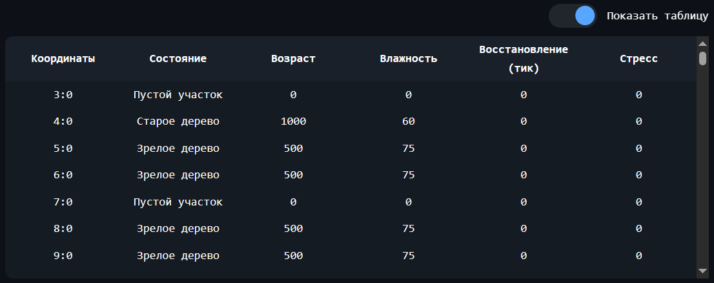

# 🌲 Интерактивная модель лесных пожаров

[](https://react.dev/)
[](https://developer.mozilla.org/en-US/docs/Web/JavaScript)
[](https://vite.dev/)

> Стохастическая модель динамики лесных экосистем с учётом роста деревьев, климатических факторов, распространения пожаров и восстановления леса.

---

## Оглавление

- [Описание](#описание)
- [Технологический стек](#технологический-стек)
- [Структура проекта](#структура-проекта)
- [Математическая модель](#математическая-модель)
- [Сборка и запуск](#сборка-и-запуск)
- [Скриншоты](#скриншоты)

## Описание

**Интерактивная модель лесных пожаров** — это веб-приложение, моделирующее динамику лесного участка с учётом множества взаимосвязанных факторов:

- **Рост деревьев** — переход между возрастными стадиями (молодое => зрелое => старое)
- **Климат** — смена сезонов, глобальная влажность, экстремальные засухи
- **Ветер** — направление и сила, влияющие на распространение огня
-  **Погода** — три состояния (ясно, дождь, гроза) с ударами молний и тушением осадками
- **Пожары** — распространение огня с учётом влажности, типа дерева, сухостоя и ветра
- **Водоёмы** — естественные преграды для распространения огня
- **Восстановление** — регенерация леса после пожаров с учётом сезона
- **Гидравлический стресс** — накопление стресса у старых деревьев в период засухи

Модель предоставляет пользователю **гибкие настройки** и **интерактивное управление** в реальном времени.

---

##  Технологический стек

| Компонент | Технология 
|-----------|-----------|
| **Фронтенд** | React 19 |
| **Сборка** | Vite 8 |
| **Стилизация** | CSS Modules |
| **Статистика** | Recharts |
| **Язык** | JavaScript (ES2022)
| **Хранилище** | localStorage |

---

## Структура проекта
```text
Forest-Fire-Simulator/
├── public/
├── screenshots/
├── src/
│   ├── App.jsx
│   ├── index.css
│   ├── main.jsx
│   ├── cfg/
│   │   ├── constants.js
│   │   └── settings.js
│   ├── Components/
│   │   ├── button/
│   │   │   ├── button.jsx
│   │   │   ├── button.module.css
│   │   │   └── index.js
│   │   ├── cell/
│   │   │   ├── cell.jsx
│   │   │   ├── cell.module.css
│   │   │   └── index.js
│   │   ├── checkbox/
│   │   │   ├── checkbox.jsx
│   │   │   ├── checkbox.module.css
│   │   │   └── index.js
│   │   ├── control-panel/
│   │   │   ├── control-panel.jsx
│   │   │   ├── control-panel.module.css
│   │   │   └── index.js
│   │   ├── data-table/
│   │   │   ├── data-table.jsx
│   │   │   ├── data-table.module.css
│   │   │   └── index.js
│   │   ├── env-indicators/
│   │   │   ├── env-indicators.jsx
│   │   │   ├── env-indicators.module.css
│   │   │   └── index.js
│   │   ├── footer/
│   │   │   ├── footer.jsx
│   │   │   ├── footer.module.css
│   │   │   └── index.js
│   │   ├── grid/
│   │   │   ├── grid.jsx
│   │   │   ├── grid.module.css
│   │   │   └── index.js
│   │   ├── header/
│   │   │   ├── header.jsx
│   │   │   ├── header.module.css
│   │   │   └── index.js
│   │   ├── help/
│   │   │   ├── help.jsx
│   │   │   ├── help.module.css
│   │   │   └── index.js
│   │   ├── panel/
│   │   │   ├── index.js
│   │   │   ├── panel.jsx
│   │   │   └── panel.module.css
│   │   ├── properties-block/
│   │   │   ├── index.js
│   │   │   ├── properties-block.jsx
│   │   │   └── properties-block.module.css
│   │   ├── settings-panel/
│   │   │   ├── Defaults.js
│   │   │   ├── index.js
│   │   │   ├── settings-panel.jsx
│   │   │   └── settings-panel.module.css
│   │   ├── slider/
│   │   │   ├── index.js
│   │   │   ├── slider.jsx
│   │   │   └── slider.module.css
│   │   ├── statistic-block/
│   │   │   ├── index.js
│   │   │   ├── statistic-block.jsx
│   │   │   └── statistic-block.module.css
│   │   └── toggle-button/
│   │       ├── index.js
│   │       ├── toggle-button.jsx
│   │       └── toggle-button.module.css
│   ├── core/
│   │   ├── climate-controller.js
│   │   ├── forest-controller.js
│   │   ├── weather-controller.js
│   │   └── wind-controller.js
│   ├── models/
│   │   ├── cell.js
│   │   ├── index.js
│   │   ├── environment/
│   │   │   ├── ash.js
│   │   │   ├── empty.js
│   │   │   └── water.js
│   │   └── tree/
│   │       ├── adult-tree.js
│   │       ├── dead-tree.js
│   │       ├── old-tree.js
│   │       ├── statistic.js
│   │       ├── tree.js
│   │       └── young-tree.js
│   └── utils/
│       └── saveUtils.js
├── .gitignore
├── eslint.config.js
├── index.html
├── package.json
├── package-lock.json
├── README.md
└── vite.config.js
```


## Математическая модель

### Поле модели

Поле модели представляет собой матрицу из $H \ge 1$ строк и $W \ge 1$ столбцов. В каждой ячейке матрицы в конкретный момент времени и в конкретном состоянии находится ровно один объект.

### Логические сущности

**Клетка** – минимальная единица абстракции поля, имеющая координаты $(x, y)$, где $0 \le x < W, 0 \le y < H$. Каждая клетка характеризуется состоянием, принимающим значения из множества: *пустая, молодое дерево, зрелое дерево, старое дерево, сухостой, очаг возгорания, пепел, молния, водоём, лёд*.

**Дерево** – общая сущность, включающая следующие состояния: молодое (young), зрелое (adult), старое (old), сухостой (dead), очаг возгорания (fire), пепел (ash), молния (lightning).

Характеристики:
- $moisture$ – влажность ($moisture \ge 0$)
- $age$ – возраст ($age \ge 0$)
- $burnDuration$ – длительность горения ($0 \le burnDuration \le burnDurationTicks$)
- $stress$ – гидравлический стресс (для старых деревьев) ($stress \ge 0$)

**Пустая клетка** – не является деревом, не работает со влажностью, возрастом и какими-либо другими параметрами. Представляет собой место для потенциального роста нового дерева.

**Пепел** – возникает после пожара, обладает счётчиком тиков (времени) восстановления $recoveryTicks \le minRecoveryTicks$. При $recoveryTicks = minRecoveryTicks$ становится пустой клеткой.

**Молния** – временное состояние клетки, возникающее при ударе молнии во время грозы. Клетка в этом состоянии визуально отображается как вспышка и на следующем тике переходит в состояние очага возгорания.

**Водоём** – клетка, занятая водой. Не является деревом, не участвует в процессах высыхания и воспламенения. Представляет собой естественную преграду для распространения огня – пламя не может перейти на клетку с водой и не может пройти через неё.

**Лёд** – состояние воды в зимний период. Визуально отличается от воды, но сохраняет все свойства преграды. Переход из воды в лёд и обратно происходит автоматически при смене сезона.

### Климат

Модель климата включает в себя расчёт текущего сезона:

$$ i_{\text{тек}} = \left\lfloor \frac{t}{T_{\text{сезона}}} \bmod N_{\text{сезонов}} \right\rfloor $$

где $i_{\text{тек}}$ – индекс текущего сезона, $t$ – текущее время (тик), $T_{\text{сезона}}$ – длительность сезонов, $N_{\text{сезонов}}$ – общее количество сезонов (весенний, летний, осенний, зимний).

Обработка шанса возникновения засухи осуществляется при условии:

$$ \text{rand}(0,1) \le P_{\text{засухи}}(i_{\text{тек}}) $$

где $\text{rand}(0,1)$ – случайное вещественное число от 0 до 1, $P_{\text{засухи}}(i_{\text{тек}})$ – вероятность засухи в конкретный сезон.

Длительность засухи рассчитывается случайным образом с учётом заданного предела:

$$ T_{\text{засухи}} = \text{randint}(1, T_{\text{засухи,max}}) $$

Засуха прекращается при выполнении одного из следующих условий:

$$ \begin{cases} T_{\text{засухи}} \ge T_{\text{засухи,max}} \\\\ i_{\text{тек}} = i_{\text{зим}} \\\\ \text{наличие осадков} \end{cases} $$

Осадками считаются состояния погоды `RAINY` и `STORMY`. Засуха не возникает при наличии осадков.

### Ветер

Ветер изменяется в связи с текущим сезоном при условии, что:

$$ T_{\text{ветренной погоды}} \le T_{\text{ветренной погоды,max}} $$

$T_{\text{ветренной погоды,max}}$ выбирается случайным образом в диапазоне от 0 до $T_{\text{пред}}$.

Направление ветра рассчитывается исходя из списка вероятностей следующим образом:

$$ d_{\text{тек}} = \begin{cases} d_1, & \text{при } 0 \le \xi < P_1 \\\\ d_2, & \text{при } P_1 \le \xi < P_1 + P_2 \\\\ \ldots \\\\ d_n, & \text{при } P_{n-1} \le \xi < P_{n-1} + P_n \end{cases} $$

где $d_{\text{тек}}$ – выбираемое направление ветра, $\xi$ – случайное вещественное число в диапазоне от 0 до 1.

### Погода

Погода $w \in \{\text{CLEAR}, \text{RAINY}, \text{STORMY}\}$ обновляется через случайные интервалы. Длительность текущего состояния погоды $T_{\text{погоды}}$ ограничена порогом $L_{\text{погоды}}$. Когда $T_{\text{погоды}} \ge L_{\text{погоды}}$ или погода только что установлена, выбирается новое состояние по вероятностям, зависящим от сезона:

$$ w = \begin{cases} w_1, & \text{если } 0 \le \xi < p_1 \\\\ w_2, & \text{если } p_1 \le \xi < p_1 + p_2 \\\\ w_3, & \text{если } p_1 + p_2 \le \xi < 1 \end{cases} $$

где $\xi$ – случайное число из $[0,1)$, $p_1, p_2, p_3$ – вероятности для состояний CLEAR, RAINY, STORMY в текущем сезоне.

Глобальная влажность $M_{\text{глоб}}$ с учётом погоды вычисляется как:

$$ M_{\text{глоб}} = \min\left(H_{\text{макс}}, \text{round}\bigl(H_{\text{сез}}(i_{\text{сез}}) \cdot \alpha(w)\bigr)\right) $$

где:
- $H_{\text{макс}}$ – максимально возможная влажность,
- $H_{\text{сез}}$ – базовая влажность сезона,
- $\alpha(w)$ – модификатор погоды.

При активной экстремальной засухе погодные модификаторы не применяются, а влажность устанавливается на уровне $M_{\text{засухи}}$.

### Водоёмы

При инициализации поля на нём случайным образом генерируются извилистые водные каналы. Количество каналов $K$ выбирается случайно в диапазоне $[1, C_{\text{max}}]$, где $C_{\text{max}}$ – настраиваемый порог количества каналов.

Каждый канал состоит из $M$ меандров, где $M$ выбирается случайно в диапазоне $[1, M_{\text{max}}]$ ($M_{\text{max}}$ – настраиваемый порог извилистости). Каждый сегмент канала имеет длину $L$, выбираемую случайно в диапазоне $[1, L_{\text{max}}]$ ($L_{\text{max}}$ – настраиваемый порог длины сегмента). Направление каждого сегмента выбирается случайно из восьми возможных направлений.

В зимний период ($i_{\text{тек}} = i_{\text{зим}}$) все клетки воды переходят в состояние льда:

$$ \text{state} = \text{ICE}, \quad \text{если } \text{state} = \text{WATER} \text{ и } i_{\text{тек}} = i_{\text{зим}} $$

В остальные сезоны лёд тает:

$$ \text{state} = \text{WATER}, \quad \text{если } \text{state} = \text{ICE} \text{ и } i_{\text{тек}} \ne i_{\text{зим}} $$

### Рост деревьев

Рост (переход существующего дерева между возрастными состояниями) происходит следующим образом:

$$ \text{state} = \text{adult}, \quad \text{если } \text{state} = \text{young} \text{ и } age > youngToAdultAge $$

$$ \text{state} = \text{old}, \quad \text{если } \text{state} = \text{adult} \text{ и } age > adultToOldAge $$

### Горение

Если ячейка находится в состоянии горения ($\text{state} = \text{fire}$), то существуют два способа её тушения:

1. **Естественное тушение осадками.** Если текущая погода является дождливой ($w = \text{RAINY}$ или $w = \text{STORMY}$), то с вероятностью $P_{\text{туш}}(w)$ клетка тушится до истечения срока горения:

```math
   $$ \text{state} = \text{nativeType}, \quad \text{если } \text{rand}(0,1) < P_{\text{туш}}(w) $$
```

   где $P_{\text{туш}}(w)$ – вероятность тушения при определённой погоде. При успешном тушении клетка возвращается в исходное состояние, соответствующее её типу.

2. **Выгорание.** Если клетка не была потушена и её длительность горения достигла предела $T_{\text{горения,max}}$, она переходит в состояние пепла ($\text{state} = \text{ash}$):

```math
   $$ \text{state} = \text{ash}, \quad \text{если } \text{state} = \text{fire} \text{ и } burnDuration \ge T_{\text{горения,max}} $$
```
### Восстановление

Если ячейка находится в состоянии пепла, то на каждом шаге существует сезонная вероятность увеличения счётчика восстановления $recoveryTicks$ до достижения минимального порога:

$$ recoveryTicks = recoveryTicks + 1, \quad \text{если } \begin{cases} \text{state} = \text{ash}, \\\\ \text{rand}(0,1) < P_{\text{восст}}(i_{\text{тек}}), \\\\ recoveryTicks < T_{\text{восст,min}} \end{cases} $$

Как только счётчик времени восстановления достигает или превышает минимально необходимый лимит, ячейка переходит в состояние пустого участка:

$$ \text{state} = \text{empty}, \quad \text{если } \begin{cases} \text{state} = \text{ash}, \\\\ recoveryTicks \ge T_{\text{восст,min}} \end{cases} $$

где $T_{\text{восст,min}}$ – минимальное время, необходимое для восстановления почвы.

### Появление новых деревьев

Если ячейка пуста, то на ней может случайным образом вырасти молодое дерево. Шанс появления зависит от базовой вероятности и сезонного множителя:

$$ \text{state} = \text{young}, \quad \text{если } \begin{cases} \text{state} = \text{empty}, \\\\ \text{rand}(0,1) < P_{\text{баз}} \cdot k_{\text{сез}}(i_{\text{тек}}) \end{cases} $$

где $P_{\text{баз}}$ – базовая вероятность появления дерева за один тик, а $k_{\text{сез}}(i_{\text{тек}})$ – коэффициент интенсивности роста текущего сезона.

В период экстремальной засухи появление новых деревьев блокируется независимо от сезонного множителя.

### Реагирование на внешнюю среду

Если ячейка занята живым деревом ($\text{young} \le \text{state} \le \text{old}$), то на каждом шаге модели происходит инкремент его возраста ($age = age + 1$). Текущий уровень влажности дерева изменяется в соответствии с состоянием соседних клеток и глобальной влажностью.

#### Высыхание от пожара

Если количество горящих соседних ячеек $N_{\text{гор}} > 0$, то дерево интенсивно теряет влагу пропорционально числу очагов и индивидуальной скорости высыхания $v_{\text{выс}}$:

$$ moisture = \max(0, moisture - N_{\text{гор}} \cdot v_{\text{выс}}) $$

$$ v_{\text{выс}} = (A - M_{\text{глоб}} \cdot B) \cdot k_{\text{тип}} $$

где:
- $A$ – максимальная скорость высыхания при низкой влажности,
- $M_{\text{глоб}}$ – глобальная влажность воздуха,
- $B$ – коэффициент влияния влажности воздуха на скорость высыхания,
- $k_{\text{тип}}$ – индивидуальный множитель скорости высыхания для конкретного типа дерева.

#### Высыхание от сухостоя

Если горящих соседей нет, но есть высохшие деревья ($N_{\text{сух}} > 0$) и активна экстремальная засуха, то потеря влаги усиливается за счёт сухостоя, но действует слабее открытого огня:

$$ moisture = \max(0, moisture - N_{\text{сух}} \cdot v_{\text{выс}} \cdot k_{\text{сух}}) $$

где $k_{\text{сух}}$ – коэффициент влияния сухостоя.

#### Пассивное высыхание

Если опасных соседей рядом нет, но глобальная влажность воздуха опускается ниже критического порога ($M_{\text{глоб}} < M_{\text{пассив,max}}$), то дерево теряет влагу со своей индивидуальной вероятностью $P_{\text{выс}}(M_{\text{глоб}})$:

$$ moisture = \max(0, moisture - v_{\text{пассив}}), \quad \text{если } \text{rand}(0,1) < P_{\text{выс}}(M_{\text{глоб}}) $$

где $v_{\text{пассив}}$ – базовая скорость пассивного высыхания, а $M_{\text{пассив,max}}$ – верхний предел влажности, ниже которого начинается пассивная потеря влаги.

#### Выравнивание влажности деревьев с климатом

В случае отсутствия негативных факторов влажность дерева стремится к глобальной влажности $M_{\text{глоб}}$:

1. Впитывание влаги (если дерево суше воздуха):

```math
    $$ moisture = \min(M_{\text{глоб}}, moisture + v_{\text{впит}}), \quad \text{при } moisture < M_{\text{глоб}} $$
```

2. Испарение влаги (если дерево влажнее воздуха):

```math
    $$ moisture = \max(M_{\text{глоб}}, moisture - v_{\text{исп}}), \quad \text{при } moisture > M_{\text{глоб}} $$
```

где $v_{\text{впит}}$ – скорость прироста влаги, а $v_{\text{исп}}$ – скорость испарения.

### Гидравлический стресс (только для старых деревьев)

У старых деревьев присутствует защитный механизм блокировки потери влаги в условиях экстремальной засухи, сопровождающийся накоплением гидравлического стресса.

Если активна экстремальная засуха, то дерево с вероятностью $P_{\text{стресс}}$ увеличивает показатель стресса на фиксированную величину $\Delta_{\text{stress}}$:

$$ stress = stress + \Delta_{\text{stress}}, \quad \text{если } \text{rand}(0,1) < P_{\text{стресс}} $$

где $P_{\text{стресс}}$ – вероятность накопления стресса за один тик, $\Delta_{\text{stress}}$ – приращение стресса.

Если величина накопленного стресса достигает критического порога, то дерево погибает и переходит в состояние сухостоя:

$$ \text{state} = \text{dead}, \quad \text{если } stress > stress_{\text{max}} $$

где $stress_{\text{max}}$ – максимальное значение стресса, выше которого дерево погибает.

Если экстремальная засуха завершилась, то дерево постепенно восстанавливается, снижая уровень стресса с фиксированной скоростью до нулевого значения:

$$ stress = \max(0, stress - v_{\text{сброс}}), \quad \text{если засуха не активна} $$

где $v_{\text{сброс}}$ – скорость восстановления дерева за один тик.

### Воспламенение

Для всех живых деревьев и сухостоя ($\text{young} \le \text{state} \le \text{dead}$) на каждом шаге рассчитывается комплексная вероятность возгорания, которая зависит от дефицита влаги, наличия сухостоя вокруг и направления ветра.

#### Воспламенение от молнии

Во время грозы ($w = \text{stormy}$) с вероятностью $P_{\text{молнии}}$ за тик происходит удар молнии, который переводит клетку в состояние lightning:

$$ \text{state} = \text{lightning}, \quad \text{если } \begin{cases} w = \text{stormy}, \\\\ \text{rand}(0,1) < P_{\text{молнии}} \end{cases} $$

На следующем тике клетка превращается в очаг возгорания:

$$ \text{state} = \text{fire}, \quad \text{если } \text{state} = \text{lightning} $$

#### Итоговый шанс воспламенения

Итоговый шанс воспламенения клетки $P_{\text{пож}}$ вычисляется как произведение коэффициента сухости, базовой уязвимости дерева, фактора сухостоя и общего множителя среды:

$$ P_{\text{пож}} = P_{\text{баз.пож}} \cdot k_{\text{влаж}} \cdot k_{\text{сух}} \cdot k_{\text{распр}} $$

$$ k_{\text{влаж}} = \frac{100 - moisture}{100} $$

$$ k_{\text{сух}} = \begin{cases} k_{\text{сух}}, & \text{если } N_{\text{сух}} > 0 \\\\ 1.0, & \text{если } N_{\text{сух}} = 0 \end{cases} $$

где:
- $P_{\text{баз.пож}}$ – базовый шанс возгорания определённого типа дерева,
- $k_{\text{влаж}}$ – коэффициент влияния влажности дерева,
- $k_{\text{сух}}$ – коэффициент расширения пожара за счёт соседствующего сухостоя,
- $k_{\text{распр}}$ – общий коэффициент распространения огня,
- $N_{\text{сух}}$ – количество сухостоев вокруг.

Если присутствует ветер с вектором смещения $\vec{s} = (dx, dy)$, то для каждого горящего соседа рассчитывается вектор относительного положения:

$$ \vec{r} = (x_{\text{клетки}} - x_{\text{соседа}}, y_{\text{клетки}} - y_{\text{соседа}}) $$

Если вектор соседа совпадает с вектором ветра ($\vec{s} = \vec{r}$), то дерево считается ориентированным по ветру, а шанс его возгорания увеличивается за счёт множителя:

$$ \text{state} = \text{fire}, \quad \text{если } \text{rand}(0,1) < P_{\text{пож}} \cdot k_{\text{ветер}} $$

где $k_{\text{ветер}}$ – коэффициент усиления огня ветром (сила ветра).

Если ячейка имеет горящих соседей, но не совпадает с вектором направления ветра, либо если во время экстремальной засухи влажность дерева упала ниже критического порога ($moisture < moisture_{\text{крит}}$), то проверка на возгорание выполняется следующим образом:

$$ \text{state} = \text{fire}, \quad \text{если } \text{rand}(0,1) < P_{\text{итог}} $$

$$ P_{\text{итог}} = \begin{cases} \frac{P_{\text{пож}}}{k_{\text{ветер}}}, & \text{если есть ветер, но клетка не ориентирована по нему} \\\\ P_{\text{пож}}, & \text{в остальных случаях} \end{cases} $$

где $P_{\text{итог}}$ – скорректированная вероятность возгорания с учётом направления ветра.

### Самовозгорание

Распространение от соседних горящих клеток происходит всегда, независимо от засухи. Дополнительно, в условиях экстремальной засухи и критически низкой влажности дерева ($moisture < M_{\text{крит}}$) возможно самовозгорание:

$$ \text{state} = \text{FIRE}, \quad \text{если } \begin{cases} \text{isExtremeDrought}, \\\\ \text{isCriticalDry}, \\\\ \text{rand}(0,1) < P_{\text{пож}} \end{cases} $$

где $M_{\text{крит}}$ – критический порог влажности, $P_{\text{пож}}$ – стандартный шанс воспламенения.

## Сборка и запуск

### Установка зависимостей

```
npm install
```
или
```
pnpm install / yarn install
```

### Запуск
  **Запуск локального сервера с мгновенным обновлением кода при сохранении**
  ```
  npm run dev
  ```
  *Ссылка по умолчанию:* `http://localhost:5173`

  Сборка в режиме Release. Результат сохраняется в папку `/dist`:
  ```
  npm run build
  ```  
  Запуск встроенного сервера Vite для проверки готовых файлов релиза из папки `/dist`
  ```
  npm run preview
  ```
  *Важно:* Команда не собирает проект заново - требуется предварительный вызов `npm run build`.


## Скриншоты

### Главный экран


### Таблица



### Панель параметров
<table>
  <tr>
    <td></td>
    <td></td>
  </tr>
  <tr>
    <td></td>
    <td></td>
  </tr>
</table>